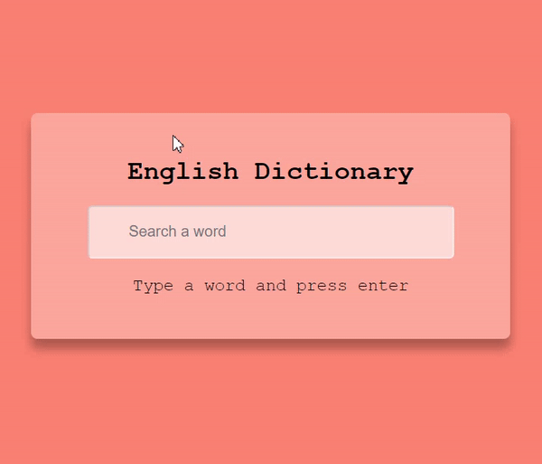

# English-Dictionary


## 기능 
영어 단어를 입력을 하면 뜻과 오디오가 출력  

## API
https://dictionaryapi.dev/  

## 학습
### 1. JS : 키보드 이벤트 
사용자가 키를 누르거나 키를 놓을 때 발생  

- 키를 누를 때는 keydown 타입의 이벤트가 발생  
```
window.addEventListener("keydown", e => {
  const key = document.getElementById(e.key);
  if (key) key.classList.add('pressed');
});
```

- 키를 놓을 때는 keyup 타입의 이벤트가 발생
```
window.addEventListener("keyup", e => {
  const key = document.getElementById(e.key);
  if (key) key.classList.remove('pressed');
});
```

### 2. JS : 논리 연산자  
연산자|이름|예제|결과
---|---|---|---|
&&|AND|a && b|a와 b 모두 true면 true
ll|OR|a ll b|a, b 둘 중 하나라도 true면 true
! |NOT|!true|false 


## 학습 출처   
**유튜브**  
https://www.youtube.com/@JavaScriptKing  

**JS**  
https://www.daleseo.com/js-key-events/  
https://ko.javascript.info/logical-operators    
https://anerim.tistory.com/36  

**키워드**  
- 키보드 이벤트   
- 논리 연산자  